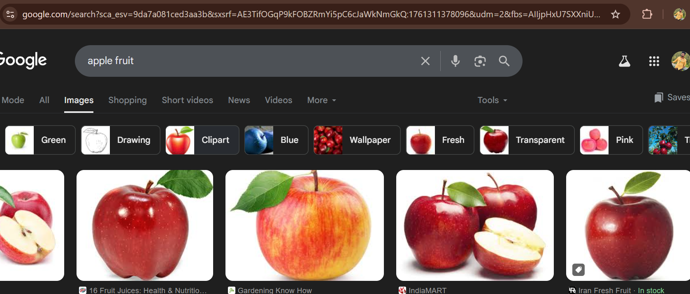

# line 1
## line 2
### line 3
#### line 4

1) line 5
2) line 6
3) line 7

- line 8
- line 9

    - line 10
    - line 11
        - line 12
        - line 13


`line 14`
```
print("Hello World")
```

